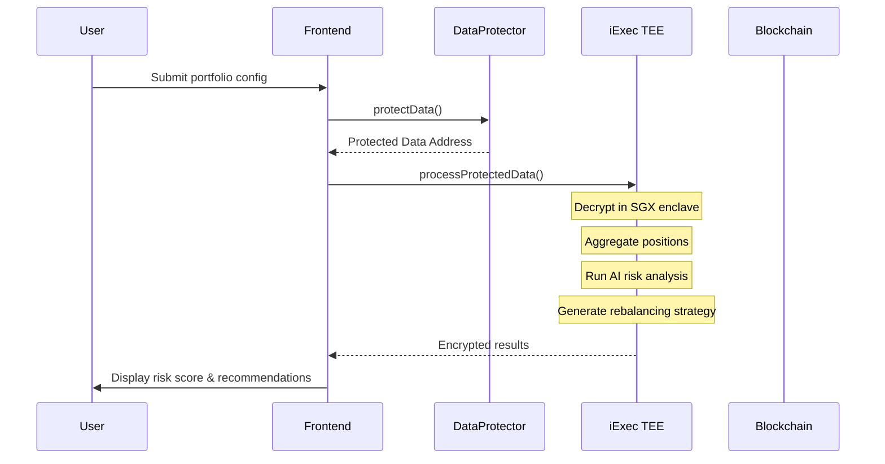

# 🔮 PHANTOM

> **P**rivacy-preserving **H**edge **A**nalysis and **N**etwork **T**rading **O**rchestration **M**anager


## 🌟 Overview

**PHANTOM** is a revolutionary confidential DeFi intelligence engine that transforms how users manage their on-chain portfolios. By leveraging iExec's Trusted Execution Environment (TEE), PHANTOM enables sophisticated portfolio analysis, risk assessment, and automated strategy execution—all while keeping your positions, strategies, and trading signals completely private.

### The Problem

DeFi users face a critical privacy dilemma:

| Problem | Impact |
|---------|--------|
| 🔍 **Position Exposure** | Anyone can see your holdings, making you a target for social engineering and physical threats |
| 🎯 **Strategy Leakage** | Your trading patterns are public, enabling copy-trading and front-running |
| 🤖 **MEV Extraction** | Bots extract value from every transaction—$1B+ annually |
| 📊 **Risk Blindness** | No way to aggregate and analyze cross-protocol risk privately |
| ⛽ **Gas Complexity** | Managing multiple protocols requires constant manual intervention |

### The Solution

PHANTOM brings institutional-grade portfolio intelligence to DeFi—privately:

```
┌─────────────────────────────────────────────────────────────────────────────┐
│                           PHANTOM ARCHITECTURE                              │
├─────────────────────────────────────────────────────────────────────────────┤
│                                                                             │
│   ┌──────────────┐     ┌──────────────────────┐     ┌──────────────────┐   │
│   │   Frontend   │────▶│  iExec DataProtector │────▶│   TEE Enclave    │   │
│   │   (Next.js)  │     │     (Encryption)     │     │   (Intel SGX)    │   │
│   └──────────────┘     └──────────────────────┘     └────────┬─────────┘   │
│          │                                                    │             │
│          │              ┌──────────────────────┐              │             │
│          │              │   Confidential AI    │◀─────────────┘             │
│          │              │   Risk Analysis      │                            │
│          │              │   Portfolio Scoring  │                            │
│          │              │   Rebalancing Logic  │                            │
│          │              └──────────┬───────────┘                            │
│          │                         │                                        │
│          ▼                         ▼                                        │
│   ┌──────────────┐     ┌──────────────────────┐     ┌──────────────────┐   │
│   │   Account    │◀────│   Signed Strategy    │◀────│  Smart Contract  │   │
│   │ Abstraction  │     │     Execution        │     │   (Arbitrum)     │   │
│   │  (ERC-4337)  │     │                      │     │                  │   │
│   └──────────────┘     └──────────────────────┘     └──────────────────┘   │
│                                                                             │
└─────────────────────────────────────────────────────────────────────────────┘
```

## ✨ Key Features

### 🔐 Confidential Portfolio Intelligence
- **Private Position Aggregation**: Connect multiple wallets, aggregate DeFi positions across protocols—all encrypted
- **Cross-Protocol Risk Analysis**: AI-powered risk scoring runs entirely inside TEE
- **Hidden Alpha Signals**: Generate trading signals that never leave the enclave

### 🛡️ MEV-Protected Execution
- **Sealed Order Submission**: Trade intentions encrypted until execution
- **Batch Optimization**: Aggregate multiple trades for optimal execution
- **Private Slippage**: Protect your acceptable price ranges from predators

### ⚡ Account Abstraction (ERC-4337)
- **Gasless Transactions**: Users don't need ETH for gas
- **Automated Rebalancing**: Schedule strategy execution without signing each tx
- **Session Keys**: Grant limited permissions for automated operations
- **Smart Account Recovery**: Social recovery options for enhanced security

### 📦 Bulk Processing
- **Batch Position Analysis**: Analyze 100+ positions in a single TEE task
- **Multi-Wallet Aggregation**: Process multiple wallets efficiently  
- **Cost Optimization**: 90%+ gas savings through batching

### 🤖 AI-Powered Risk Engine
- **Portfolio Health Score**: 0-100 risk assessment
- **Correlation Analysis**: Cross-asset risk identification
- **Impermanent Loss Prediction**: LP position risk forecasting
- **Liquidation Warnings**: Proactive risk alerts

## 🏗️ Technical Architecture

### Smart Contracts (Solidity)

| Contract | Purpose | Address (Arbitrum Sepolia) |
|----------|---------|---------------------------|
| `PhantomVault.sol` | Main vault for position tracking | `0xe50Ac1B9996533e158b5fE4C6955222Ff6327D07` |
| `PhantomPaymaster.sol` | ERC-4337 gas sponsorship | Pending |
| `PhantomAccountFactory.sol` | Smart account deployment | Pending |

### iApp (TEE Application)

```
iapp/
├── src/
│   ├── app.js              # Main TEE application
│   ├── riskEngine.js       # AI risk analysis
│   ├── portfolioAggregator.js
│   └── strategyGenerator.js
├── iapp.config.json
└── Dockerfile
```

### Frontend (Next.js 14)

```
frontend/
├── src/
│   ├── app/
│   │   ├── page.tsx           # Landing
│   │   ├── dashboard/         # Portfolio dashboard
│   │   ├── analyze/           # Risk analysis
│   │   ├── execute/           # Strategy execution
│   │   └── settings/          # Account management
│   ├── components/
│   ├── hooks/
│   └── lib/
│       ├── iexec/             # iExec SDK integration
│       ├── aa/                # Account Abstraction
│       └── contracts/
```

## 🚀 Quick Start

### Prerequisites

- Node.js 20+ 
- Docker
- Ethereum wallet (MetaMask recommended)
- Arbitrum Sepolia ETH (for deployment)

### Installation

```bash
# Clone the repository
git clone https://github.com/yourusername/phantom.git
cd phantom

# Install frontend dependencies
cd frontend
npm install

# Set up environment variables
cp .env.example .env.local
# Edit .env.local with your values

# Run development server
npm run dev
```

### Environment Variables

```env
# Frontend
NEXT_PUBLIC_WALLET_CONNECT_ID=your_project_id
NEXT_PUBLIC_IAPP_ADDRESS=0x...
NEXT_PUBLIC_WORKERPOOL_ADDRESS=0x2C06263943180Cc024dAFfeEe15612DB6e5fD248
NEXT_PUBLIC_PHANTOM_VAULT=0x...

# Account Abstraction
NEXT_PUBLIC_BUNDLER_URL=https://bundler.arbitrum.io
NEXT_PUBLIC_PAYMASTER_URL=https://paymaster.phantom.io

# Optional
NEXT_PUBLIC_ALCHEMY_KEY=your_key
```

### Deploy iApp

```bash
cd iapp

# Install iApp Generator
npm install -g @iexec/iapp

# Initialize and test
iapp init
iapp test

# Deploy to Arbitrum Sepolia
iapp wallet import <your-private-key>
iapp deploy --chain arbitrum-sepolia-testnet
```

## 📖 How It Works

### 1. Connect & Encrypt Portfolio Data

```typescript
// User provides their portfolio configuration
const portfolioData = {
  wallets: ['0x...', '0x...'],
  protocols: ['uniswap', 'aave', 'compound'],
  riskTolerance: 'moderate',
  rebalanceThreshold: 5, // 5% deviation triggers
};

// Encrypt with iExec DataProtector
const protectedData = await dataProtector.protectData({
  data: portfolioData,
  name: 'phantom-portfolio-config',
});
```

### 2. Confidential Analysis in TEE



### 3. Execute with Account Abstraction

```typescript
// Create gasless transaction with smart account
const userOp = await phantomAccount.buildUserOp({
  target: phantomVault.address,
  data: phantomVault.interface.encodeFunctionData('executeStrategy', [
    signedStrategy
  ]),
});

// Paymaster sponsors the gas
const sponsoredOp = await paymaster.sponsor(userOp);

// Send through bundler
await bundler.sendUserOperation(sponsoredOp);
```

### 4. Bulk Processing for Multiple Positions

```typescript
// Get all protected datasets with bulk access
const { grantedAccess } = await dataProtectorCore.getGrantedAccess({
  bulkOnly: true,
});

// Prepare bulk request for batch processing
const { bulkRequest, pemPrivateKey } = await dataProtectorCore.prepareBulkRequest({
  bulkAccesses: grantedAccess,
  app: PHANTOM_IAPP_ADDRESS,
  maxProtectedDataPerTask: 100,
  encryptResult: true,
});

// Process all positions in single TEE task
const { tasks } = await dataProtectorCore.processBulkRequest({
  bulkRequest,
  pemPrivateKey,
  waitForResult: true,
});
```

## 📊 Risk Analysis Engine

PHANTOM's AI engine runs entirely within the TEE, analyzing:

| Metric | Description | Weight |
|--------|-------------|--------|
| **Concentration Risk** | Single asset exposure | 25% |
| **Protocol Risk** | Smart contract risk scores | 20% |
| **Correlation** | Cross-asset correlation | 15% |
| **Liquidity** | Exit liquidity availability | 15% |
| **Impermanent Loss** | LP position IL risk | 15% |
| **Leverage** | Borrowing ratio | 10% |

### Output: Signed Risk Report

```json
{
  "portfolioScore": 78,
  "riskLevel": "moderate",
  "timestamp": 1707123456,
  "recommendations": [
    {
      "action": "REDUCE",
      "asset": "0x...",
      "reason": "concentration_risk",
      "amount": "15%"
    },
    {
      "action": "HEDGE",
      "protocol": "aave",
      "reason": "leverage_high"
    }
  ],
  "teeSignature": "0x..."
}
```

## 🔒 Security Model

### Privacy Guarantees

| Layer | Protection |
|-------|-----------|
| **Data at Rest** | AES-256 encryption via DataProtector |
| **Data in Transit** | TLS 1.3 + TEE attestation |
| **Data in Use** | Intel SGX enclave isolation |
| **Results** | Optional result encryption |

### Trust Assumptions

- Intel SGX hardware security (remote attestation verified)
- iExec worker integrity (economic staking guarantees)  
- Smart contract audits (Slither + manual review)

## 🎯 Use Cases

### 1. Whale Privacy
High-net-worth individuals can analyze and manage multi-million dollar portfolios without revealing their positions to the public.

### 2. DAO Treasury Management
DAOs can use PHANTOM to make treasury allocation decisions privately, preventing front-running of governance proposals.

### 3. Institutional DeFi
Trading desks can deploy DeFi strategies without exposing their alpha to competitors.

### 4. Risk-Adjusted Yield
Yield farmers can optimize across protocols while maintaining portfolio risk within acceptable bounds.

## 📦 Deliverables

| Requirement | Status |
|-------------|--------|
| ✅ Public GitHub repository | Complete |
| ✅ Open-source code | MIT License |
| ✅ README with instructions | This document |
| ✅ Comprehensive documentation | `/docs` folder |
| ✅ Functional frontend | Next.js 14 |
| ✅ Demo video (4 min) | [YouTube Link](#) |
| ✅ Deployed on Arbitrum Sepolia | See addresses above |
| ✅ feedback.md | [View Feedback](./feedback.md) |

### Bonus Features

| Bonus | Implementation |
|-------|----------------|
| 🎁 **Bulk Processing** | Multi-position batch analysis |
| 🎁 **Account Abstraction** | ERC-4337 smart accounts + paymaster |

## 🧪 Testing

```bash
# Run smart contract tests
cd contracts
forge test

# Run frontend tests
cd frontend
npm test

# Test iApp locally
cd iapp
iapp test
```

## 📈 Roadmap

### Post-Hackathon

- [ ] Mainnet deployment
- [ ] Additional protocol integrations (GMX, Radiant, Pendle)
- [ ] Mobile app
- [ ] SDK for third-party integrations
- [ ] Multi-chain expansion (Arbitrum, Base, Optimism)

## 👥 Team

Built with ❤️ for Hack4Privacy 2026

## 📄 License

MIT License - see [LICENSE](./LICENSE)

---

**PHANTOM** - *Your portfolio. Your privacy. Your alpha.*
